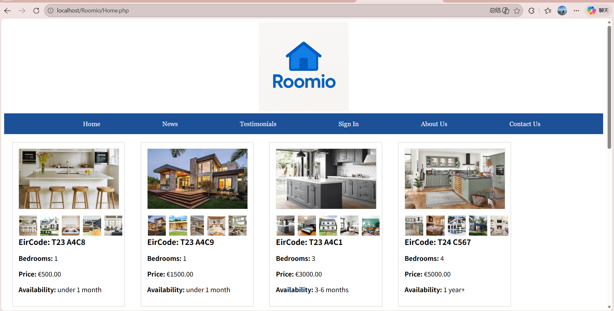

Roomio - Full-Stack Property Rental Platform



About The Project
Roomio is a comprehensive full-stack web application designed for property rental management. It provides an intuitive interface for users to browse available properties, view detailed specifications (e.g., EirCodes, pricing, availability), and contact property managers. The system is built with a custom PHP backend and a relational database to ensure dynamic data rendering and secure user sessions.

Key Features
* **Dynamic Property Catalog:** Browse houses with multi-image galleries, localized Irish EirCodes, and real-time availability status.
* **User Authentication:** Secure sign-in functionality with session management.
* **Responsive UI:** CSS Grid/Flexbox layouts ensuring the site looks great on desktop and mobile.
* **Security Measures:** Implemented prepared statements (PDO) to prevent SQL injection and secure backend data handling.

Tech Stack
* **Frontend:** HTML5, CSS3, Vanilla JavaScript
* **Backend:** PHP 8.x
* **Database:** MySQL
* **Architecture:** MVC (Model-View-Controller) pattern

Getting Started (Local Installation)
To get a local copy up and running, follow these simple steps.

Prerequisites
* A local server environment like XAMPP, MAMP, or a custom LAMP stack on Linux.
* PHP (>= 7.4) and MySQL installed.

### Installation Steps

1. **Clone the repository:**
   ```bash
   git clone https://github.com/DerrickLongkai/Roomio.git

2. Set up the local server:
Move the cloned Roomio folder into your local server directory (e.g., htdocs for XAMPP, or /var/www/html/ for a LAMP stack).

3. Database Setup:
Open your database manager (e.g., phpMyAdmin).
Create a new database named roomio_db (or your preferred name).
Import the provided SQL dump file: database/dzt_db.sql.

4. Configure Database Connection:
Open your database connection PHP file (e.g., config.php or db_connect.php in your code).
Update the credentials to match your local server environment:
$host = 'localhost';
$username = 'root';
$password = ''; // Your local MySQL password
$database = 'roomio_db'; // Must match the name you created in Step 3

5. Run the Application:
Open your web browser and navigate to: http://localhost/Roomio/Home.php
